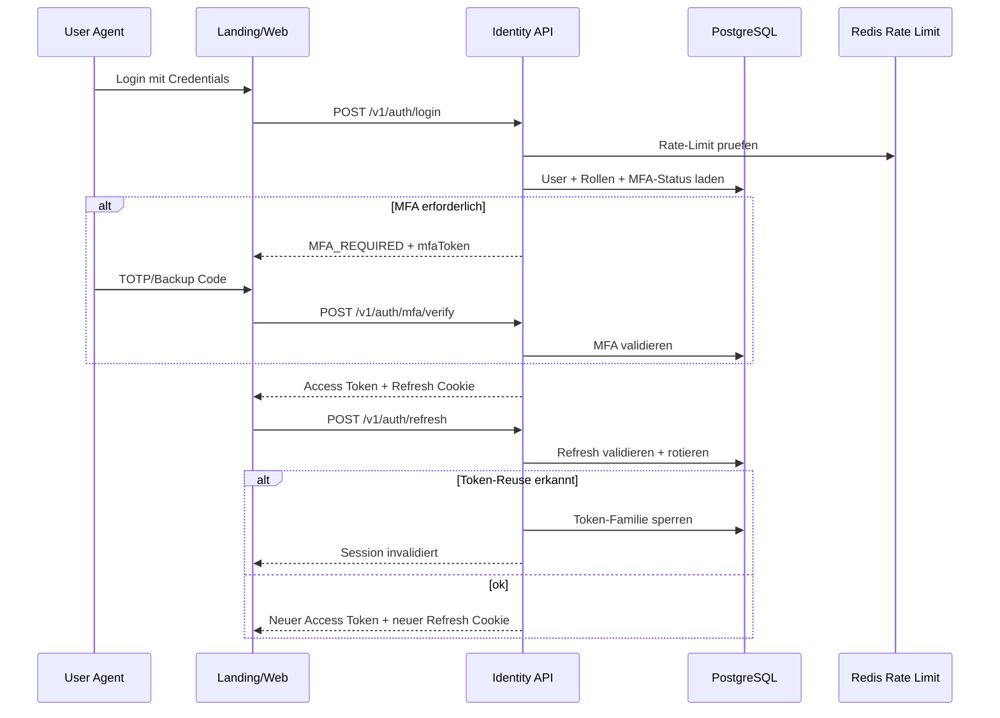

# Diagram: Auth Runtime Flow

```mermaid
sequenceDiagram
  participant User as User Agent
  participant App as Landing/Web
  participant API as Identity API
  participant DB as PostgreSQL
  participant Redis as Redis Rate Limit

  User->>App: Login mit Credentials
  App->>API: POST /v1/auth/login
  API->>Redis: Rate-Limit pruefen
  API->>DB: User + Rollen + MFA-Status laden

  alt MFA erforderlich
    API-->>App: MFA_REQUIRED + mfaToken
    User->>App: TOTP/Backup Code
    App->>API: POST /v1/auth/mfa/verify
    API->>DB: MFA validieren
  end

  API-->>App: Access Token + Refresh Cookie

  App->>API: POST /v1/auth/refresh
  API->>DB: Refresh validieren + rotieren
  alt Token-Reuse erkannt
    API->>DB: Token-Familie sperren
    API-->>App: Session invalidiert
  else ok
    API-->>App: Neuer Access Token + neuer Refresh Cookie
  end
```
