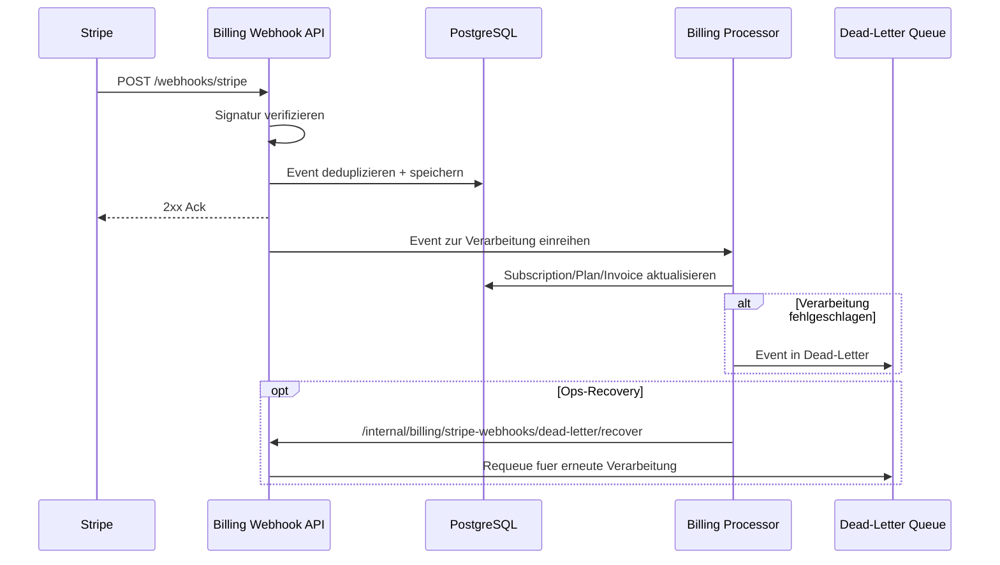

# Diagram: Billing Webhook Runtime Flow

```mermaid
sequenceDiagram
  participant Stripe as Stripe
  participant API as Billing Webhook API
  participant DB as PostgreSQL
  participant Worker as Billing Processor
  participant DLQ as Dead-Letter Queue

  Stripe->>API: POST /webhooks/stripe
  API->>API: Signatur verifizieren
  API->>DB: Event deduplizieren + speichern
  API-->>Stripe: 2xx Ack

  API->>Worker: Event zur Verarbeitung einreihen
  Worker->>DB: Subscription/Plan/Invoice aktualisieren

  alt Verarbeitung fehlgeschlagen
    Worker->>DLQ: Event in Dead-Letter
  end

  opt Ops-Recovery
    Worker->>API: /internal/billing/stripe-webhooks/dead-letter/recover
    API->>DLQ: Requeue fuer erneute Verarbeitung
  end
```
