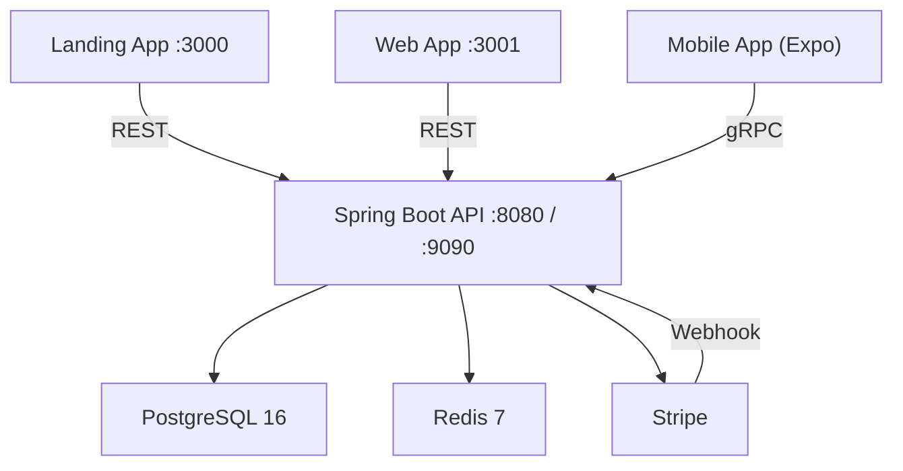

# Diagram: Container View (C4 Level 2)

```mermaid
flowchart TD
  landing["Landing App :3000"]
  web["Web App :3001"]
  mobile["Mobile App (Expo)"]
  api["Spring Boot API :8080 / :9090"]
  postgres["PostgreSQL 16"]
  redis["Redis 7"]
  stripe["Stripe"]

  landing -->|REST| api
  web -->|REST| api
  mobile -->|gRPC| api
  api --> postgres
  api --> redis
  api --> stripe
  stripe -->|Webhook| api
```
