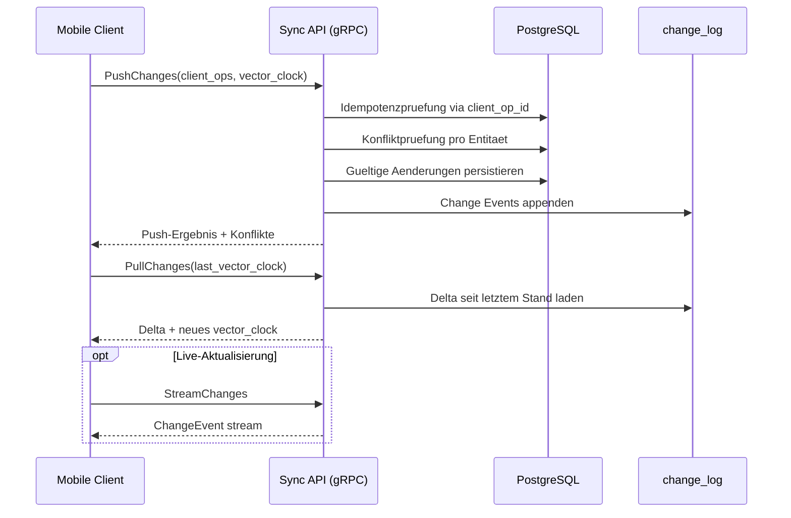

# Diagram: Sync Runtime Flow

```mermaid
sequenceDiagram
  participant Mobile as Mobile Client
  participant API as Sync API (gRPC)
  participant DB as PostgreSQL
  participant CL as change_log

  Mobile->>API: PushChanges(client_ops, vector_clock)
  API->>DB: Idempotenzpruefung via client_op_id
  API->>DB: Konfliktpruefung pro Entitaet
  API->>DB: Gueltige Aenderungen persistieren
  API->>CL: Change Events appenden
  API-->>Mobile: Push-Ergebnis + Konflikte

  Mobile->>API: PullChanges(last_vector_clock)
  API->>CL: Delta seit letztem Stand laden
  API-->>Mobile: Delta + neues vector_clock

  opt Live-Aktualisierung
    Mobile->>API: StreamChanges
    API-->>Mobile: ChangeEvent stream
  end
```
