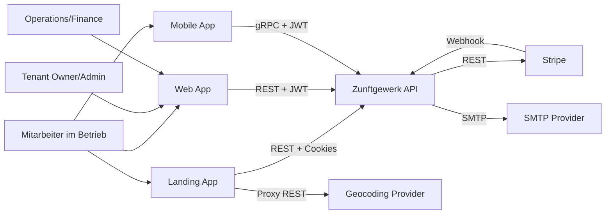

# Diagram: System Context (C4 Level 1)

```mermaid
flowchart LR
  user1["Mitarbeiter im Betrieb"]
  user2["Tenant Owner/Admin"]
  user3["Operations/Finance"]

  landing["Landing App"]
  web["Web App"]
  mobile["Mobile App"]
  api["Zunftgewerk API"]

  stripe["Stripe"]
  smtp["SMTP Provider"]
  geo["Geocoding Provider"]

  user1 --> landing
  user1 --> web
  user1 --> mobile
  user2 --> web
  user3 --> web

  landing -->|REST + Cookies| api
  web -->|REST + JWT| api
  mobile -->|gRPC + JWT| api

  api -->|REST| stripe
  stripe -->|Webhook| api
  api -->|SMTP| smtp
  landing -->|Proxy REST| geo
```
